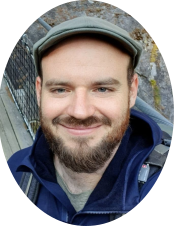

# Bio-image analysis technology development group (BiAPoL)

*<h3>An image analysis group with expertise in Machine Learning who got your back and your pixels</h3>*

Welcome to the profile of the bio-image analysis technology development group (BiAPoL) at [Physics of Life / TU Dresden](https://physics-of-life.tu-dresden.de/). We provide services and tools for the analysis of microscopy images in the life sciences. If you have any questions or need help with image analysis, feel free to contact us (see contact information below).

## Services

| | |
|---|---|
|   | 
 <h2>**Image Data Science Consulting** </h2>   **We provide services for the analysis of microscopy images in the life sciences** <ol> <li>Method Exploration</li> <li>Pair Programming</li> </ol> 
|
|  | 
 <h2>**Internship/mini-sabbaticals Development** </h2>   **Stay with us to bolster your analysis and code proficiency** <ol> <li>2-4 weeks lab rotation for a focused bio-image analysis task</li> <li>Turn images into knowledge </li> </ol> 
|
|  | 
 <h2>**Plugin/library development** </h2>   **Make your code sustainable and reusable** <ol> <li>[FAIRness](https://www.go-fair.org/fair-principles/)</li> <li>Napari plugins, Fiji plugins, Jupyter notebooks or Python libraries (i.e., PyPi)</li> </ol> 
|
|  | 
 <h2>**Rent-a-scientist** </h2>   **Pay us to support your work** <ol> <li>Organize workshops or other teaching events</li> <li>Get the help of a professional image data scientist for your project to make a leap forward.</li> </ol> 
|

## Members

We are currently three postdocs and one student working in the group:

| | |
|---|---|
|  | 
 <h2>**Marcelo Zoccoler** (Postdoc) </h2>   Interested in Image + Signal Processing, Fluorescence Lifetime-based Segmentation, Time-lapse Signal Classification, Machine Learning, Software and Plugin Development @zoccoler 
|
|  | 
 <h2>**Johannes Soltwedel** (Postdoc) </h2>   Interested in segmentation, machine/deep learning, algorithms, teaching, surface meshes and geometry. 
 @jo-mueller|
|  | 
 <h2>**Stefan Hahmann** (Postdoc) </h2>   Interested in Research Software Engineering, Fiji Plugins, Feature Extraction, Deep Learning, Classification, Graphs, Open Source. 
 @stefanhahmann|
|  | 
 <h2>**Maleeha Hassan** (Student) </h2>   Interested in Image Analysis, Machine Learning, meshes and cancer organoids. 
 @maleehahassan|

## Contact

For more information on our current and previous members and our mission, visit our [group page](https://physics-of-life.tu-dresden.de/research/core-groups/bio-image-analysis). For requests, please contact us via email (biapol (at) tu-dresden.de). For image analysis questions, please make sure to also check the image analysis [forum](https://forum.image.sc/).

Please understand that, regarding image analysis, our first and foremost responsibilities are to the Physics of Life institute and the Dresden Life Science community. We will try to help you as much as possible, but we may not be able to provide immediate support.
